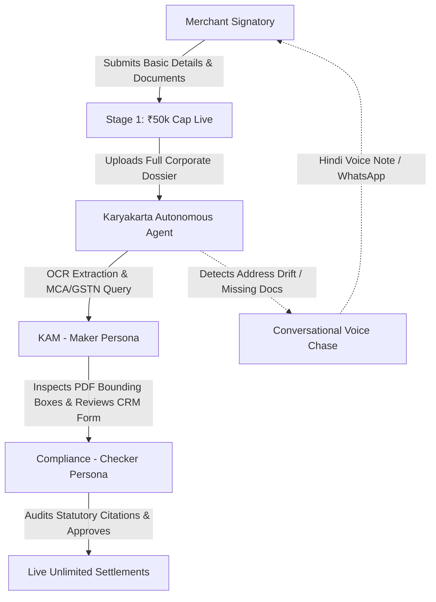

# KARYAKARTA · Intelligent Corporate Merchant Onboarding
## System Overview, Role Specifications & Frontend Architecture

---

### 1. Executive Summary & Product Context

**KARYAKARTA AI** is an enterprise-grade fintech onboarding platform engineered for **Paytm Business Corporate Payment Gateway**. It transforms corporate Merchant KYC (Know Your Customer) and KYB (Know Your Business) from an onerous, multi-week manual document exchange into an intelligent, autonomous, and audit-proof workflow.

#### Core Challenges Solved:
1. **The ₹50,000/Month Limit Bottleneck**: Newly onboarded merchants are restricted to a Stage 1 provisional monthly settlement limit of ₹50,000 until full corporate document verification is completed.
2. **Document Extraction Fatigue**: Manual entry of 50+ corporate entities across PAN, GST, MCA21, and banking proofs is eliminated using autonomous OCR and cross-registry validation.
3. **Discrepancy Resolution Loop**: Instead of cold, uninformative rejection emails, Karyakarta AI provides conversational multi-channel resolution—including localized Hindi voice calls—to guide merchants through exact document corrections.
4. **Statutory & Regulatory Governance**: Built-in adherence to India's **Digital Personal Data Protection (DPDP) Act, 2023** and **Information Technology Act, 2000**, with immutable audit logs and consent capture.

---

### 2. Design System & Aesthetics

The frontend is styled using **Paytm's corporate brand identity** coupled with modern typography:
- **Primary Navy**: `#002970` (Signature Paytm corporate deep blue)
- **Deep Contrast Navy**: `#001b4c` (Hover states & elevated surfaces)
- **Vibrant Cyan**: `#00BAF2` (Active indicators, focus rings, callout badges)
- **Soft Cyan Tint**: `#e6f7fc` / `#cfe9fc` (Backgrounds, subtle borders, selection states)
- **Typography**: Google Font **Plus Jakarta Sans** (clean, geometric, fintech-grade) with **JetBrains Mono** for numbers, CIN, GSTIN, and code citations.

---

### 3. Role Breakdown & Feature Matrix

The platform is architected around three core personas:



| Dimension | Role 1: Merchant Signatory | Role 2: Key Account Manager (Maker) | Role 3: Compliance Officer (Checker) |
| :--- | :--- | :--- | :--- |
| **Primary Goal** | Complete onboarding to unlock unlimited daily settlements | Triage incoming cases, review AI extractions, chase missing proofs | Perform four-eyes principle audit, verify statutory consent, approve |
| **Access URL** | `/dashboard/stage-1`, `/dashboard/*` | `/kam`, `/kam/cases/:id` | `/kam` (Persona Toggle: Compliance) |
| **Core Screens** | 4 Views + Statutory PDF Modal | Pipeline Dashboard + Case Workspace | Checker Audit & Sanctions Review |
| **AI Interaction** | Conversational voice alerts & guided re-upload | Bounding box inspection & CRM override | Verification score validation & DPDP audit trail |

---

### 4. Deep Dive: Frontend Roles & Screen Architecture

```
src/
├── components/
│   ├── merchant/
│   │   ├── MerchantAuthScreen.tsx      # Mobile OTP login with Paytm branding
│   │   └── MerchantUploadScreen.tsx    # 4 Sub-screens + DPDP Statutory Modal
│   ├── kam/
│   │   ├── KamWorkspaceShell.tsx       # Top bar, persona switcher, cyan-accented sidebar
│   │   ├── KamDashboardView.tsx        # Pipeline view, 5 KPI cards, interactive table
│   │   ├── CaseDetailOverview.tsx      # 8-stage tracker, two-column checklist
│   │   ├── PdfEvidenceViewer.tsx       # Split-screen mock PDF with bounding boxes
│   │   ├── AutoFilledCrmForm.tsx       # 100% AI pre-populated CRM master form
│   │   └── VoiceChasePanel.tsx         # Multi-channel Hindi voice chase drawer
│   └── shared/
│       ├── Brand.tsx                   # KARYAKARTA · AI logo mark
│       └── ProgressBar.tsx             # Animated progress indicator
```

---

#### Role 1: The Corporate Merchant
**Target Users**: Business Owners, Managing Directors, Finance Officers.

##### 1. Authentication (`/login`)
- **Components**: [`MerchantAuthScreen.tsx`](file:///Users/sam22ridhi/Downloads/project%203/src/components/merchant/MerchantAuthScreen.tsx)
- **Features**:
  - Branded dual-pane authentication in Paytm Navy (`#002970`) and Vibrant Cyan (`#00BAF2`).
  - Mobile number input with 6-digit OTP verification.
  - Zero password vulnerability, secured by Karyakarta corporate gateway.

##### 2. Stage 1 Provisional Dashboard (`/dashboard/stage-1`)
- **Components**: `StageOne` in [`MerchantUploadScreen.tsx`](file:///Users/sam22ridhi/Downloads/project%203/src/components/merchant/MerchantUploadScreen.tsx)
- **Features**:
  - Celebratory emerald banner: `✓ Account Live (Stage 1)`.
  - Account status pill: `Cap reached · ₹50,000/month limit`.
  - Prominent Paytm Deep Navy CTA card: *"To unlock unlimited settlements and remove the ₹50k cap, please complete your Corporate KYC verification with Karyakarta AI."*
  - Fast-forward CTA: `Upgrade to Unlimited Settlements →` linking directly to Document Upload.

##### 3. Account Center (`/dashboard/account-center`)
- **Components**: `AccountCenter` in [`MerchantUploadScreen.tsx`](file:///Users/sam22ridhi/Downloads/project%203/src/components/merchant/MerchantUploadScreen.tsx)
- **Features**:
  - Form section: Legal Entity Name, Company PAN (`AABCU9603R`), Bank Account Number.
  - **DPDP Act 2023 Consent Section**:
    - Data fiduciary authorization checkbox for document extraction.
    - Consent checkbox for querying official government registries (MCA21, GSTN, CBDT).
    - `View DPDP Act 2023 Statutory Consent (PDF)` trigger opening the legally binding modal.

##### 4. Documents Upload Portal (`/dashboard/upload`)
- **Components**: `UploadPortal` in [`MerchantUploadScreen.tsx`](file:///Users/sam22ridhi/Downloads/project%203/src/components/merchant/MerchantUploadScreen.tsx)
- **Features**:
  - 4 Statutory Categorized Requirement Cards:
    1. *Business & Registration Proof* (Shop Act, Regional State Registration, Municipal License, Utility Bills).
    2. *Settlement Bank Account Details* (Cancelled cheque, Bank-attested letter, Current account requirement).
    3. *Tax & GST Documents* (Company PAN, GST REG-06).
    4. *Identity & Governance Proofs* (Board resolution, Director KYC).
  - Expandable rule breakdown with accepted formats (`.pdf`, `.jpg`, `.png` up to 25MB).
  - Drag-and-drop quick dropzone with cryptographic hashing badge.

##### 5. AI Communication Center (`/dashboard/action-required`)
- **Components**: `ActionRequired` in [`MerchantUploadScreen.tsx`](file:///Users/sam22ridhi/Downloads/project%203/src/components/merchant/MerchantUploadScreen.tsx)
- **Features**:
  - Discrepancy Alert: Address mismatch between GST Certificate (*Navi Mumbai*) and application (*Mumbai*).
  - **Interactive Voice Player**: Native Hindi voice note (*"नमस्ते, कृपया अपना नया पते का प्रमाण अपलोड करें..."*) with animated frequency waves.
  - One-click targeted dropzone for uploading updated utility bills.

##### 6. DPDP Act 2023 Statutory PDF Agreement Modal
- **Components**: `DpdpAgreementModal` in [`MerchantUploadScreen.tsx`](file:///Users/sam22ridhi/Downloads/project%203/src/components/merchant/MerchantUploadScreen.tsx)
- **Features**:
  - Formatted like a statutory legal document under Section 6 of the DPDP Act, 2023.
  - Data fiduciary obligations, sovereign registry lookup boundaries, withdrawal rights, and SHA-256 consent logging.

---

#### Role 2: Key Account Manager (KAM - Maker)
**Target Users**: Senior KAMs, Onboarding Specialists, Merchant Success Leads.

##### 1. Global Shell & Navigation
- **Components**: [`KamWorkspaceShell.tsx`](file:///Users/sam22ridhi/Downloads/project%203/src/components/kam/KamWorkspaceShell.tsx)
- **Features**:
  - **Top Bar**: Greeting (*"Welcome back, Priya"*), Persona toggle (`KAM (Maker)` / `Compliance (Checker)`), AI status indicator (`● Online`), and quick switch to the Merchant view.
  - **Sidebar**: Four navigation items (`Dashboard (Home)`, `All Cases`, `Risk Alerts`, `Settings`) featuring a **Cyan left border indicator** (`border-l-4 border-[#00BAF2]`) and light cyan background tint (`bg-[#e6f7fc]`).

##### 2. The Main Pipeline Dashboard (`/kam`)
- **Components**: [`KamDashboardView.tsx`](file:///Users/sam22ridhi/Downloads/project%203/src/components/kam/KamDashboardView.tsx)
- **Features**:
  - Greeting: *"Welcome, Priya. Here is your pipeline."*
  - **5 Real-time KPI Cards**:
    1. `Total Open Cases` (42 cases, +8 this week)
    2. `Pending AI Verification` (14 cases, avg 42 sec processing)
    3. `Awaiting Merchant Action` (8 cases, 3 voice chases queued)
    4. `Ready for Submission` (17 cases, 100% pre-filled)
    5. `Escalations (Red)` (3 cases, SLA breach risk < 20 min)
  - **All Cases Table**: Full-width data table featuring Merchant Name, Entity Type, Stage status pills, AI Flags (e.g. *Address Drift 91%*, *MCA Matched 98%*), pulsing SLA timer, and `View Case →` action button.

##### 3. Case Detail Overview (`/kam/cases/:id`)
- **Components**: [`CaseDetailOverview.tsx`](file:///Users/sam22ridhi/Downloads/project%203/src/components/kam/CaseDetailOverview.tsx)
- **Features**:
  - **Header**: Merchant Name (*Sharma Foods Pvt Ltd*), Account Status Pill (`Cap Reached · ₹50k Limit`), and the **8-Stage Tracker**:
    *`Invited` → `Docs Upload` → `AI Verifying` → `KAM Review (Active)` → `Checker (Compliance)` → `Bank Settlement Test` → `e-Agreement Sign` → `Live Unlimited`*.
  - **Two-Column Checklist**:
    - *Left (Uploaded Documents)*: 4 verified items with green checkmarks and provenance links.
    - *Right (Missing / Action Required)*: Missing address proof & bank cheque with one-click **"Voice Chase Now"** triggers.
  - **Sub-Tabs**: `Overview & Checklist`, `Interactive PDF Evidence`, and `Auto-Filled CRM Form`.

##### 4. Interactive PDF & Entity Viewer (Tab: `Interactive PDF Evidence`)
- **Components**: [`PdfEvidenceViewer.tsx`](file:///Users/sam22ridhi/Downloads/project%203/src/components/kam/PdfEvidenceViewer.tsx)
- **Features**:
  - **Split-Screen Layout**:
    - *Left Side (PDF Canvas)*: High-fidelity Government of India Form GST REG-06 registration certificate with zoom controls and interactive **purple and yellow bounding boxes** overlaid over extracted text.
    - *Right Side (Extracted Entities)*: Entity list showing extracted strings (`Legal Name`, `Trade Name`, `GSTIN`, `Address`) with individual AI confidence scores (e.g., `99%`, `94%`).
  - Clicking any bounding box synchronizes with the right-hand panel.

##### 5. The Auto-Filled CRM Form (Tab: `Auto-Filled CRM Form`)
- **Components**: [`AutoFilledCrmForm.tsx`](file:///Users/sam22ridhi/Downloads/project%203/src/components/kam/AutoFilledCrmForm.tsx)
- **Features**:
  - **Magic Banner**: Deep purple-indigo banner:
    `✨ Form 100% Auto-Populated by Karyakarta Agent from 11 source documents.`
  - **Structured Grid Layout**:
    1. *Business Details*: Legal Name, CIN, Date of Incorporation, Registered Office, Principal Address (with discrepancy warning note), Classification.
    2. *Tax & Banking*: PAN, GSTIN, Bank Account Number, IFSC, Account Holder Name, Account Type.
    3. *Stakeholders & KBO*: Managing Director, Director DINs, Equity Percentages.
  - **Visual Cues**: Sparkle icon (`✨`) inside every field, subtle purple borders, and exact provenance citations (e.g. `Source: GST Cert p.1`, `Source: MCA21 Registry`).
  - **Bottom Action Bar**: `Edit Field (Override AI)` toggle and primary CTA `Submit to Compliance (Checker) →`.

##### 6. Multi-Channel Voice Chase Panel
- **Components**: [`VoiceChasePanel.tsx`](file:///Users/sam22ridhi/Downloads/project%203/src/components/kam/VoiceChasePanel.tsx)
- **Features**:
  - Slide-out drawer with Hindi speech preview: *"नमस्ते, मैं पेटीएम कार्यकर्ता बोल रहा हूँ..."*
  - Channel switcher: `Voice Call`, `WhatsApp Message`, `Email Dispatch`.
  - Appends audit events directly into the case timeline upon execution.

---

#### Role 3: Compliance Officer (Checker)
**Target Users**: Risk & Compliance Managers, Anti-Money Laundering (AML) Officers.

##### Core Responsibilities & Workflow:
1. **Four-Eyes Governance**: The Compliance Checker acts on cases submitted by the KAM Maker (`Stage 5`).
2. **Entity Authenticity Verification**: Cross-references AI confidence scores against sovereign registry responses from MCA21 and GSTN.
3. **Statutory Consent Audit**: Inspects the merchant's signed DPDP Act 2023 record and verified bank account ownership before granting unlimited settlement authorization.
4. **Persona Switcher**: Readily accessible via the top bar in [`KamWorkspaceShell.tsx`](file:///Users/sam22ridhi/Downloads/project%203/src/components/kam/KamWorkspaceShell.tsx).

---

### 5. Backend & Data Integration

The Python FastAPI backend ([`main.py`](file:///Users/sam22ridhi/Downloads/project%203/backend/main.py)) exposes endpoints synchronized with the frontend:
- `GET /api/cases`: Pipeline listings with stages, confidence scores, and SLA countdowns.
- `GET /api/cases/{case_id}`: Seed dossier for Sharma Foods with document metadata and timeline events.
- `POST /api/cases/{case_id}/upload`: Handles file ingestion, extraction updates, and automatic state transitions.
- `POST /api/cases/{case_id}/action`: Dispatches voice calls and records checker submissions into the immutable event trail.

---

### 6. Summary of Routing & Navigation

| Route | View Name | Target Persona | Key Functionality |
| :--- | :--- | :--- | :--- |
| `/` | Landing Page | Public | Product introduction, value proposition, quick launch |
| `/login` | Merchant Login | Merchant | Mobile OTP authentication |
| `/dashboard/stage-1` | Stage 1 Dashboard | Merchant | Provisional live status, ₹50k cap notice, upgrade CTA |
| `/dashboard/account-center` | Account Center | Merchant | Corporate entity details & DPDP 2023 consent capture |
| `/dashboard/upload` | Document Upload | Merchant | 4 categorized statutory document requirements |
| `/dashboard/action-required` | Communication Center | Merchant | Discrepancy resolution with Hindi voice player |
| `/kam` | Pipeline Dashboard | KAM / Compliance | 5 KPI cards, real-time case triage, urgency filters |
| `/kam/cases/:id` | Case Workspace | KAM / Compliance | 8-stage tracker, split-screen PDF viewer, auto-filled CRM |
