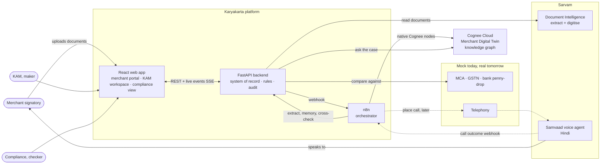
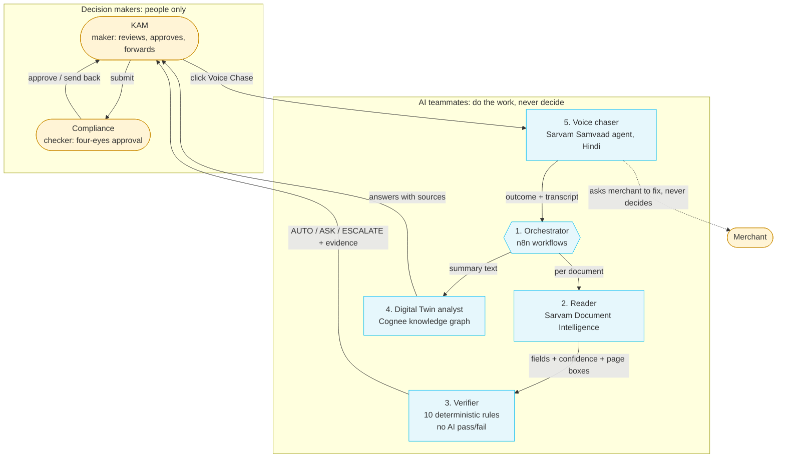
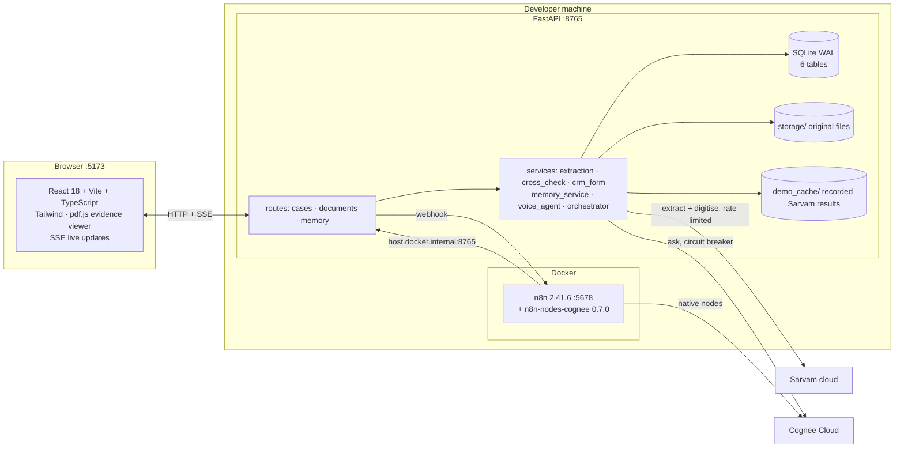
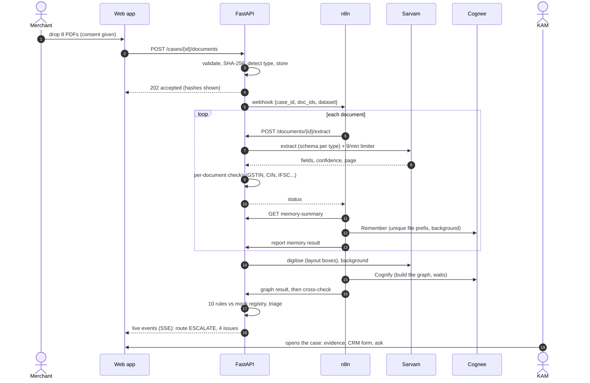
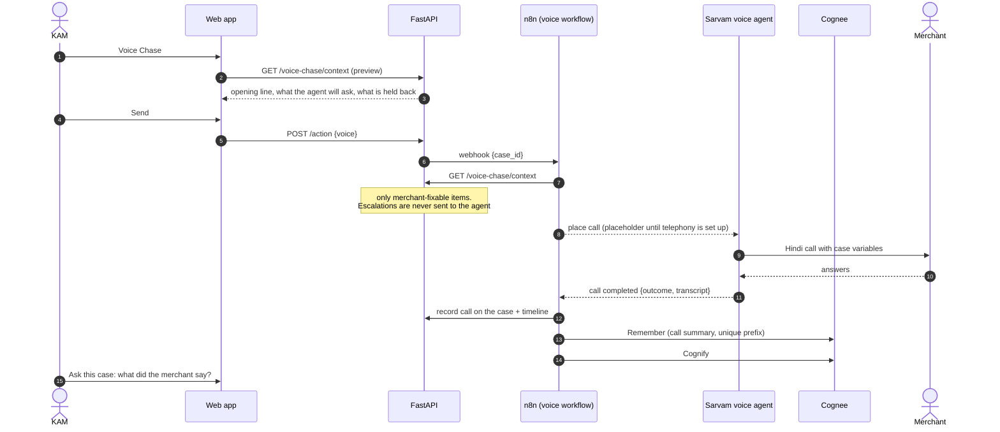
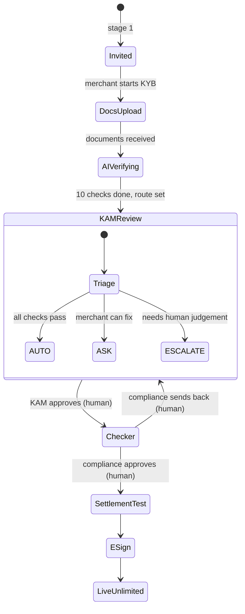
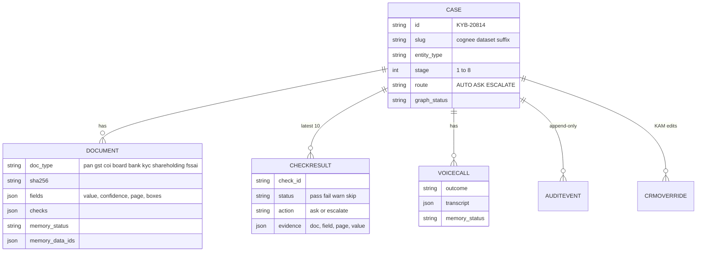
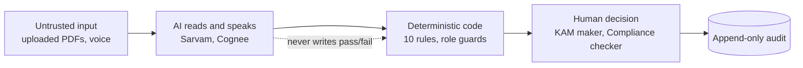
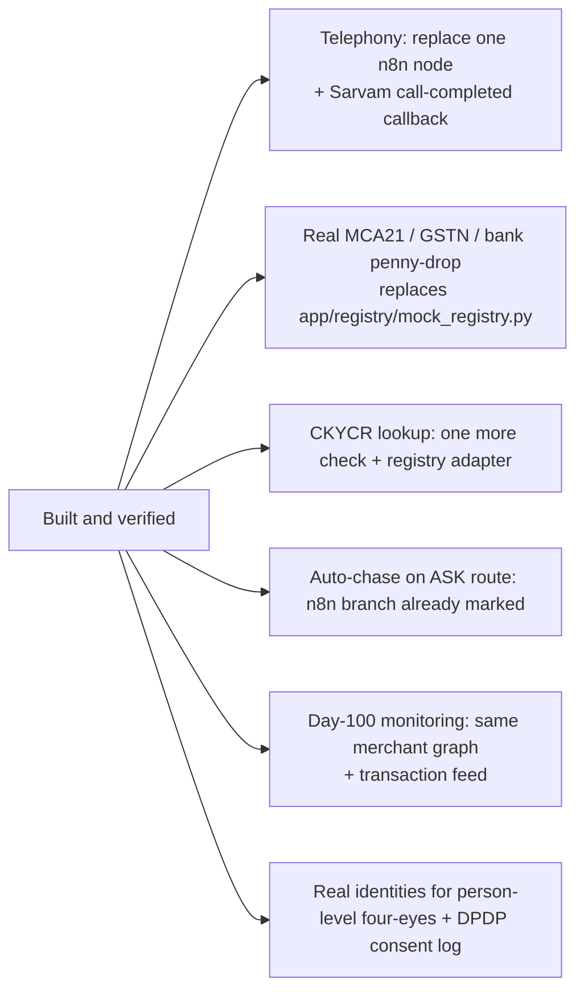

# Karyakarta: Agentic Architecture

*Team Genesis51 · Paytm Build for India AI Hackathon (Mumbai) · Track 3: Autonomous AI Teammates*

> **The model reads. Code checks. The model explains. A human approves.**
>
> Karyakarta is a team of AI teammates that does the document work of corporate merchant onboarding, so the Key Account
> Manager (KAM) only makes decisions. Every AI step is separated from every decision step by design.

Diagrams are Mermaid: they render on GitHub and in VS Code with a Mermaid preview extension. A rendered version of the
main diagram is also published as the "Karyakarta Architecture" page.

---

## 1. System context

Solid lines exist and were exercised. Dotted lines are the seams that need your phone setup (telephony) and a public
address for n8n (call-completed callback).

---

## 2. The agentic architecture: who does what

Five teammates and two human roles. The orchestrator is not an LLM; it is the conductor.

| # | Teammate | Technology | Autonomy | Hard limit |
|---|---|---|---|---|
| 1 | Orchestrator | n8n (2 workflows, 37 nodes) | Runs the whole pipeline on upload with no human step | Cannot approve; failures never stop a batch |
| 2 | Reader | Sarvam Document Intelligence | Reads every document, locates every value on the page | Reads only; every value carries a confidence and a page box |
| 3 | Verifier | Plain Python rules | Runs 10 cross-document checks and triages the case | Deterministic, repeatable, evidence on every result. **No LLM decides pass or fail** |
| 4 | Digital Twin analyst | Cognee Cloud (graph + its LLM) | Builds the merchant graph, answers questions with sources | Explains and answers; never decides |
| 5 | Voice chaser | Sarvam Samvaad (Hindi, call agent) | Speaks to the merchant about merchant-fixable items | Never discusses items needing KAM judgement; refuses OTPs; promises nothing. Triggered by the KAM today |

**People decide.** `approve`, `submit_to_compliance`, `send_back`, `compliance_approve` are refused by the API with HTTP
403 unless the actor is the right human role, and compliance can act only after the KAM has submitted (stage 5).

---

## 3. Container view (what runs where)

---

## 4. Sequence: one upload, end to end (measured: about 2 minutes for 8 documents)

If n8n is unreachable the backend runs the same steps in-process, so an upload never stalls.

---

## 5. Sequence: Voice Chase

The placeholder step and the call-completed callback are the only parts waiting on phone setup. Everything after "call
completed" is verified (with rehearsal calls: the live agent talking to a scripted merchant).

---

## 6. Case routing and lifecycle

| Route | When | What happens |
|---|---|---|
| **AUTO** | every applicable check passes | KAM approves with one click |
| **ASK** | something the merchant can fix (wrong name on cheque, address drift, missing document) | agent explains in Hindi and asks for the right document |
| **ESCALATE** | any check marked "needs human judgement" (signatory is not a director; a hidden beneficial owner) | KAM decides, with all evidence attached |

Stages 6 to 8 (settlement test, e-agreement, live unlimited) are modelled as lifecycle labels; the integrations behind them
are not built (see section 11).

---

## 7. Data architecture

* **SQLite is the system of record** (WAL mode so live streams never block writes). Cognee is only an AI memory over the same
  documents: losing it never loses data or a decision.
* **One Cognee dataset per case** (`case_<slug>`). Per item a unique file prefix (`doc-<id>`, `call-<id>`) because Cognee
  Cloud refuses a re-used file name with different content (HTTP 409).
* **The audit trail is append-only** and is both the timeline the KAM sees and the source of the live event stream.

---

## 8. Trust boundaries and guardrails

| Guardrail | Where | Enforced how |
|---|---|---|
| No AI pass/fail | Verifier | Rules are plain Python; Cognee answers questions only |
| Agent cannot approve | `POST /action` | 403 unless actor is the required human role (tested: agent and merchant refused for all four decisions) |
| Four-eyes order | `POST /action` | Compliance actions need stage 5, set only by the KAM's submit |
| Escalations stay with humans | Voice context | Checks marked "escalate" are excluded from the agent's variables |
| Agent safety rules | Voice agent prompt | No OTP/PIN/account numbers on the call, no promises of approval, documents only via the app (verified live) |
| Every value traceable | Extraction | Value, confidence, page and box shown next to the source |
| Honest failure | Everywhere | Errors recorded on the case (extraction error, memory failed, call not placed); nothing is silently faked |

Person-level four-eyes (maker is not the checker) needs real user identities. The prototype has roles, not accounts.

---

## 9. Resilience: what still works when something fails

| Failure | What happens |
|---|---|
| n8n down or workflow unpublished | Backend runs the same pipeline in-process; timeline says so |
| Cognee down / bad key | Extraction, checks, CRM form and UI keep working; documents show "memory failed"; Ask returns a clear 503 unless a saved answer exists. Circuit breaker: 2 failures, 20 s cooldown |
| Sarvam extraction fails | The document is marked error with a readable reason; other documents continue; `DEMO_MODE` serves recorded results |
| Sarvam rate limit (10 submissions/min) | Sliding-window limiter (9/min, 3 in flight) queues the rest |
| Voice call not placed | Timeline records "Voice call not placed" with the prepared items; the KAM's action is still recorded |
| Browser tab open during server reload | Graceful shutdown limited to 2 s so live streams cannot wedge the server |

---

## 10. Deployment topology (prototype)

| Component | Where | Port |
|---|---|---|
| Web app (Vite dev server) | local | 5173 |
| FastAPI backend | local, `run.bat` | 8765 |
| n8n 2.41.6 + `n8n-nodes-cognee` 0.7.0 | Docker, volume `n8n_data` | 5678 |
| Sarvam, Cognee Cloud | SaaS | n/a |

n8n reaches the backend at `host.docker.internal:8765`. Secrets live only in `backend/.env` and in the n8n credential.

---

## 11. Seams: what plugs in next

Each seam is a single module or node, not a redesign. Sections 1 and 18 of the technical documentation list what is and is
not built, item by item.
