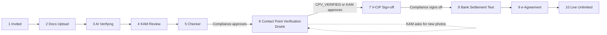
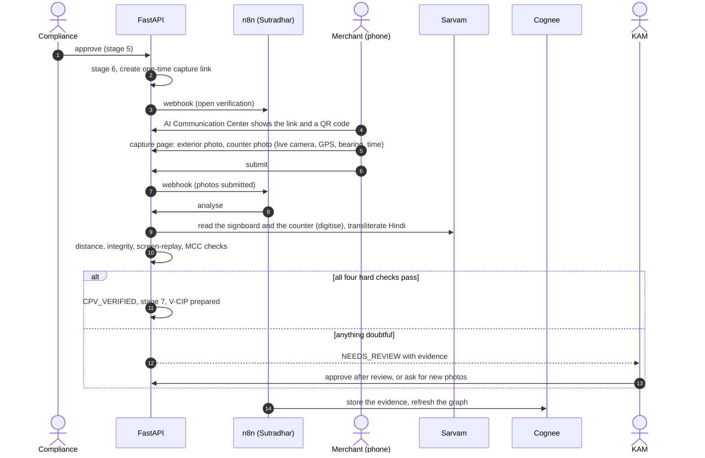

# Drishti: Contact Point Verification and V-CIP

*Team Genesis51 · Paytm Build for India AI Hackathon · Track 3: Autonomous AI Teammates*

Drishti (दृष्टि, "sight") is the sixth AI teammate. It verifies that a merchant's shop exists and is where the application says, from two live photos taken
on the merchant's phone, and it prepares the video-KYC (V-CIP) sign-off. It sits between Compliance approval and the bank settlement test.

Everything below describes what is built. Where something was tested only with synthetic data, or not tested at all, it says so.

---

## 1. What it replaces

Per the hackathon brief, contact point verification (CPV) under RBI's Payment Aggregator Directions confirms that the physical storefront exists and matches the
application. The traditional way sends a field agent with an Android app to visit the shop: 3 to 5 days and ₹250 to ₹500 per visit (figures from the brief; we have not
measured them). Drishti replaces the visit with a secure link the merchant opens at the shop.

## 2. Where it sits in the lifecycle

The lifecycle grows from 8 to 10 stages:

Compliance approval no longer jumps to the settlement test: it opens stage 6 and creates the merchant's capture link. Stages 8 to 10 are still labels without integrations.

## 3. The flow

No WhatsApp message is sent. The link appears in the merchant's AI Communication Center, with a QR code to open it on a phone, and on the KAM's case page.

## 4. The capture link and page

* **The link** is an unguessable token (about 32 characters) bound to one case, valid for 24 hours (`CPV_LINK_HOURS`). A retake or a fresh link replaces it and the old one answers
  "replaced" (HTTP 410). Up to 12 uploads per link.
* **The page** (`/cpv/<token>`, mobile first) opens only after the merchant taps Start, then asks for the camera and precise location. It has **no file input and no gallery picker**.
  Each photo is a frame drawn from the live camera stream, sent with latitude, longitude, GPS accuracy, compass bearing (when the device has one) and the time.
  It will not take a photo until GPS accuracy is within `CPV_MAX_ACCURACY_M` (100 m), and says so.
* **Server-side rules** (the page cannot be trusted): JPEG only, at most 8 MB, at least 480 pixels on the short side, valid non-zero coordinates, the photo's time within
  120 seconds of the server's clock, and the claim "captured from the camera stream".

**Honest limit:** a web page cannot prove that a photo is live or that nobody staged it. These rules make casual spoofing (a gallery photo, an old photo, a photo taken somewhere else)
hard and visible, and the checks below add evidence. They do not stop a determined attacker.

## 5. The five checks

Four are **hard** (all must pass for an autonomous pass). One is **soft**. Every result lists its evidence.

| # | Check | How | Hard / soft | Pass when |
|---|---|---|---|---|
| 1 | Capture integrity | Both photos from the live camera; no camera EXIF block (a gallery photo usually has one; a browser frame has none); GPS accuracy within 100 m; **the two photos taken at the same place** (within 75 m plus their accuracies) | Hard | none of the problems found |
| 2 | Signboard shows the trade name | Sarvam reads the exterior photo. A Hindi sign is transliterated to Latin by Sarvam. The trade name from the GST certificate (else the application) must be on the sign (word coverage, with tolerance for one OCR slip) | Hard | every word of the trade name is found |
| 3 | Within 100 m of the declared address | Haversine distance between the exterior photo's GPS and the reference point (section 7) | Hard | distance at most 100 m, and the reference is not an area-level match |
| 4 | Not a photo of a screen or a print | Frequency-spectrum heuristic (section 8) on both photos | Hard, **assistive** | score below 0.5 |
| 5 | Counter fits the declared category | Sarvam reads the counter photo; words are matched to the merchant category code (MCC 5812 restaurants, 5411 grocery, 5732 electronics, 5651 clothing, 5912 pharmacies) | Soft, **assistive** | at least one expected word is read |

Check 5 only adds a note when it does not match: a keyword match is too weak to block an otherwise clean verification. Checks 4 and 5 are heuristics, and the card marks them "Assistive".

## 6. The verdict, and who decides

* **CPV_VERIFIED**: all four hard checks pass. Drishti advances the case to stage 7 on its own, writes it to the timeline and prepares the V-CIP step.
* **NEEDS_REVIEW**: anything else. The case stays at stage 6 and a person decides.
* **Drishti never fails a shop on its own.** The KAM can **approve after review** (`cpv_approve`, stage 6 to 7) or **ask for new photos** (`cpv_retake`, a fresh link). The agent and the
  merchant cannot do either (HTTP 403); a KAM approval is refused when Drishti has not flagged anything.

## 7. Where the shop should be

The reference point is, in order: a location pin confirmed by the merchant, or a labelled demo reference; otherwise the **declared address geocoded with OpenStreetMap Nominatim**
(free; identified with a User-Agent; results cached on the case). The declared address is, in order: an electricity bill (a new optional document type read by Sarvam), the GST
principal place, the application address.

* A coarse (area-level) geocode cannot support a 100 m check, so Drishti reports the distance as unreliable and the check does not pass.
* **Demo reference:** the synthetic Sharma Foods address will not geocode precisely. With `CPV_ALLOW_DEMO_REFERENCE=true`, the Drishti card's backend route
  `POST /api/cases/{id}/cpv/demo-reference {lat, lon}` sets where the shop "is", and every use is written to the timeline as a labelled demo reference. It is off by default.
* No claim is made about how well OpenStreetMap geocodes real Indian street addresses; that was not tested.

## 8. The screen-replay heuristic, and a mistake we made

A photo of a screen carries regular pixel-grid and moire peaks in its frequency spectrum. The heuristic removes the smooth radial profile of the spectrum and scores how sharp the strongest
remaining peaks are.

* **First version flagged an honest storefront** in a live run (score 0.82). Long straight edges (shutters, signboards) put energy along the spectrum's two axes. The fix masks a band around
  both axes. Measured on edge-heavy synthetic storefronts versus screen-like overlays, the gap went from +0.2 to +3.8 (natural at most 4.5, screen-like at least 7.7).
* **Calibration used synthetic images only.** It has not been validated on real photographs. A flag means "a person should look", never "fraud".
* **Known blind spot:** a screen grid that is perfectly axis-aligned is not seen after the fix. Off-axis moire (the usual result of photographing a screen by hand) is.
* Regular textures (brick, fabric, grilles) can score high. They go to a person, which is the intended outcome.

## 9. What Sarvam read (live, synthetic images)

| Image | Sarvam read | Result |
|---|---|---|
| English sign "SHARMA FOODS" | `SHARMA FOODS` | trade name matched |
| Hindi sign "शर्मा फूड्स" | `शर्मा फूडस` (one conjunct mark dropped) | transliterated to "Sharma Foods", matched |
| Both scripts | `SHARMA FOODS शर्मा फूड्स` | matched |
| Counter with menu and QR stand | menu text including chai, thali, samosa, coffee | MCC 5812 matched |
| Wrong sign (another business) | text read correctly | not matched, sent to a person (correct) |

Without transliteration, a Hindi sign against an English GST name scored zero, which would have sent many honest shops to review. Transliteration fixed that. These are cartoon-style synthetic
images, not photographs of real shops.

## 10. V-CIP: preparing the sign-off

RBI requires an **authorised official** to do the video-based customer identification and sign it off. Karyakarta does not replace that person. It makes their part about 30 seconds.

1. When the case reaches stage 7, Drishti prepares a V-CIP record with **three randomized Hindi liveness questions**: always a random 4-digit number to repeat back (it cannot be pre-recorded),
   plus two picked at random from today's day, the month, the company's full name, the person's name, and the date of birth when an ID is on file. The expected answers are kept for the officer and
   are **not** given to the agent.
2. The compliance officer can press **Start pre-interview call**. A **second Sarvam agent** (its own prompt, `voice/SARVAM_VCIP_AGENT_SETUP.md`) calls the merchant through the same Twilio number,
   asks the questions, says only "ठीक है, धन्यवाद" after each, never says whether an answer was right, and never mentions approval. The call goes through the same n8n place-wait-poll-record flow,
   with `kind: vcip`. The transcript is recorded on the V-CIP record and is not stored in Cognee.
3. The officer's card shows the questions with the expected answers, the transcript, the owner selfie (an optional third capture on the same page) and the ID document side by side, and a
   **one-click sign-off** (`vcip_signoff`, Compliance only, stage 7 to 8). Signing off without a completed pre-interview is allowed but flagged on the timeline.

**Not automated:** face matching. No face-recognition model is integrated, and the card says so. The officer compares the faces.
**Not tested:** the V-CIP agent itself. It needs a second agent created in the Sarvam console; until `SARVAM_VCIP_AGENT_ID` is set the card says the agent is not configured and the sign-off still works.

## 11. n8n (Sutradhar)

Workflow **Karyakarta - Contact point verification** (16 nodes):
* `POST /webhook/karyakarta-cpv-start {case_id}`: create (or fetch) the secure link.
* `POST /webhook/karyakarta-cpv-captured {case_id, session_id}`: Drishti analyses (up to 4 minutes), branches on verified or review, stores the evidence in the case's Cognee dataset with the native
  Remember node (unique file name prefix `cpv-<session>`), reports it, refreshes the graph.

The voice workflow gained a `kind` parameter (`chase` or `vcip`) so one place-wait-poll-record flow serves both agents. If n8n is unreachable the backend analyses in-process.

## 12. API

| Endpoint | Purpose |
|---|---|
| `GET /api/cpv/{token}` | Public: what the capture page needs (business name, status, what to capture, GPS accuracy required). Nothing else |
| `POST /api/cpv/{token}/capture` | Public: one live-camera frame with GPS, bearing, time (multipart) |
| `POST /api/cpv/{token}/submit` | Public: send both photos for verification (starts the analysis) |
| `GET /api/cases/{id}/cpv`, `POST …/cpv/link`, `POST …/cpv/analyse` | The case's verification; create the link; run Drishti (called by n8n) |
| `GET /api/cases/{id}/cpv/images/{kind}` | The evidence photos for the case view |
| `GET /api/cases/{id}/cpv/memory-summary`, `POST …/cpv/memory/result` | What n8n stores in Cognee; report-back |
| `POST /api/cases/{id}/cpv/demo-reference` | Demo only, off by default, always on the timeline |
| `GET /api/cases/{id}/vcip` | The V-CIP record |
| `POST /api/cases/{id}/action` | adds `cpv_approve`, `cpv_retake` (KAM), `vcip_call`, `vcip_signoff` (Compliance), role and stage guarded |
| `GET /api/cases/{id}/voice-chase/context?kind=vcip`, `…/call`, `…/attempts/{id}?kind=vcip` | The V-CIP agent's context and call, through the same flow as Voice Chase |

## 13. Verified, and not

**Verified (live):** real Sarvam reading of an English and a Hindi sign and a counter, real Sarvam transliteration, the real capture API with synthetic photos, Haversine against a reference point,
the verdict and stage change, and the n8n flow through your running backend to Cognee (a mismatching sign correctly went to NEEDS_REVIEW). **Tested with mocks:** every rule and guard (129 backend
tests, 45 frontend tests), including the camera and GPS behaviour of the capture page with fake browser APIs.

**Not verified:** a real phone camera and GPS on the capture page (it needs an https tunnel, section 14); real storefront photographs; geocoding precision for real Indian addresses; the screen-replay
heuristic on real photographs; the V-CIP agent call; the layout of the new screens in a real browser.

## 14. Running it

1. `backend/.env`: `PUBLIC_APP_URL`, `N8N_CPV_WEBHOOK_URL` (already added), and for a demo `CPV_ALLOW_DEMO_REFERENCE=true`. Restart the backend.
2. **On the laptop:** open the link on `localhost` (a secure context). It uses the laptop's webcam and approximate location, so GPS accuracy may exceed 100 m; raise `CPV_MAX_ACCURACY_M` for a demo.
3. **On a phone:** run a tunnel to the web app (`ngrok http 5173` or `cloudflared tunnel --url http://localhost:5173`), put `VITE_API_URL=` (empty) in `workflowkyc/.env.local` so the app calls `/api` on the same
   origin (the dev server proxies it to the backend), set `PUBLIC_APP_URL` to the tunnel's https address, restart.
4. `python -m seed.make_shop_photos` writes four printable synthetic images to `backend/seed/shop/`. **Print them and hold them in front of the camera.** Showing them on a screen is flagged on purpose.
5. Demo order: Compliance approves a case at stage 5, the merchant opens *AI Communication Center* and the link, captures two photos, Drishti decides, the KAM sees the evidence card, Compliance signs off V-CIP.
